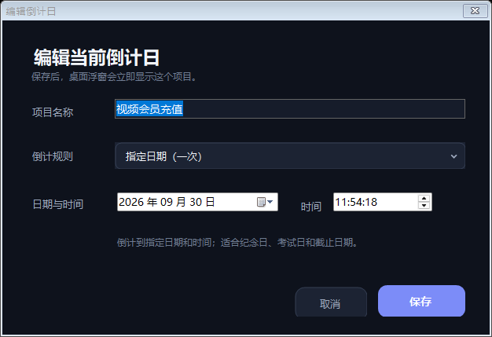

# 轻量倒计时

一款面向 Windows 10/11 的轻量桌面倒计日组件。主窗口是一列紧凑的透明倒计时，所有项目从上到下排列；每项只保留项目名、日时分秒和独立进度条。默认始终置顶，项目管理和所有操作均收纳在托盘右键菜单中。

下图为浅色桌面上的显示示意，实际运行时数字、文字和进度条之外的区域保持透明。浮窗使用逐像素透明渲染，文字边缘保留平滑的半透明抗锯齿，不使用透明色硬抠或黑色描边。

## 直接使用

请在 [Releases](https://github.com/Supaio/LightweightCountdown/releases) 下载最新版本，解压后双击 `Counter.exe` 即可运行。

- 按住项目上下拖动可以调整显示顺序，越过相邻项目中点时完成换位，松开后自动保存。先横向拖动项目或拖动项目间隙可以移动整个浮窗；拖动边缘或四角可以调整大小。
- 浮窗会吸附并限制在当前显示器的可用桌面内，顶到右上角或任务栏边缘后不会继续越界。
- 项目名、倒计时和单位都直接显示在桌面上，没有翻页牌或其他数字底板；进度条之外的区域保持透明。
- 浮窗默认始终置顶，不占任务栏；右键浮窗或托盘图标可打开完整菜单。
- 所有项目会自动纵向排列；在托盘的“选择操作项目”子菜单中指定接下来要编辑、暂停或删除的项目。
- 托盘菜单可以新建、编辑、删除、暂停、恢复或重新计算当前项目。
- “指定日期”适合纪念日、考试日、截止日等一次性目标。
- “每月重复”适合视频会员、软件订阅、话费等固定充值日。
- 每月项目到期后会自动滚动到下个月，无需重新设置。若选择 29、30 或 31 日，短月份按当月最后一天处理。
- 每月项目的红绿进度按“上一次月度日期至下一次月度日期”的完整周期计算；暂停和恢复不会再把进度重置为全绿。
- 可以同时保存、显示并运行多个项目；每项独立倒计，到期时仍会从托盘通知。
- 倒计条中绿色表示剩余时间，红色表示已经过的时间；到期后整条变红。
- 双击托盘图标可显示或隐藏浮窗；右键托盘菜单可以切换置顶、开机自启或真正退出。“始终置顶”启用时会在菜单项旁显示勾选标记。

> 如果启用开机自启后移动了 `Counter.exe`，请在新位置运行程序，并将“开机自启”关闭后重新打开一次，以更新启动路径。

## 轻量设计

- 原生 WinForms，不包含浏览器内核或第三方运行库。
- 倒计数字优先使用本机的 `Frutiger 45 Light` 粗体字形；未安装时自动回退到清晰的 Segoe UI 字体。
- 仅在至少有一个项目运行时每秒检查一次，没有后台动画和忙等待。
- 所有设置只保存在本机 `%LOCALAPPDATA%\LightweightCountdown\settings.ini`。
- 不联网、不收集数据，也不需要管理员权限。

## 退出与卸载

先在托盘菜单中点击“退出”。如果启用了开机自启，请先关闭该开关；之后可直接删除整个 `counter` 文件夹。本程序不安装服务，也不会写入系统目录。
